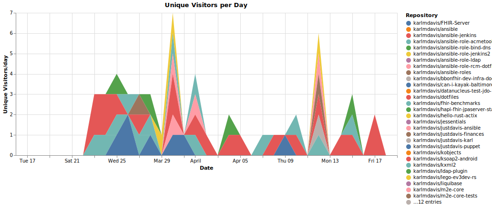
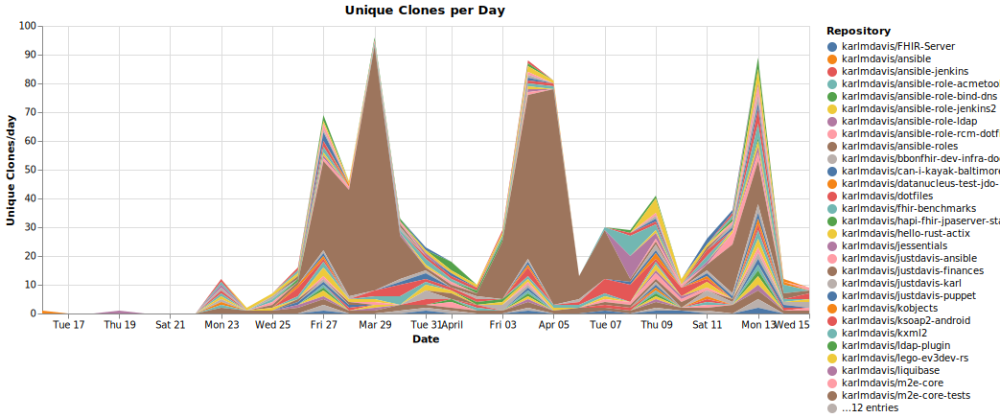

# karlmdavis

_Last updated: 2026-04-22 07:43 UTC_

## Unique Visitors per Day

## Unique Clones per Day

## Unique Visitors (avg/day)

| Repository | 2026-Q1 | 2026-Q2 |
|---|---|---|
| karlmdavis/FHIR-Server | 0.0 | 0.0 |
| karlmdavis/ansible | 0.0 | 0.0 |
| karlmdavis/ansible-jenkins | 0.0 | 0.0 |
| karlmdavis/ansible-role-acmetool | 0.0 | 0.0 |
| karlmdavis/ansible-role-bind-dns | 0.2 | 0.1 |
| karlmdavis/ansible-role-jenkins2 | 0.2 | 0.1 |
| karlmdavis/ansible-role-ldap | 0.0 | 0.0 |
| karlmdavis/ansible-role-rcm-dotfiles | 0.0 | 0.0 |
| karlmdavis/ansible-roles | 0.0 | 0.0 |
| karlmdavis/bbonfhir-dev-infra-docker | 0.0 | 0.0 |
| karlmdavis/can-i-kayak-baltimore | 0.0 | 0.0 |
| karlmdavis/datanucleus-test-jdo-1-to-n | 0.0 | 0.0 |
| karlmdavis/dotfiles | 0.0 | 0.0 |
| karlmdavis/fhir-benchmarks | 0.2 | 0.2 |
| karlmdavis/hapi-fhir-jpaserver-starter | 0.0 | 0.0 |
| karlmdavis/hello-rust-actix | 0.0 | 0.0 |
| karlmdavis/jessentials | 0.0 | 0.0 |
| karlmdavis/justdavis-ansible | 0.1 | 0.1 |
| karlmdavis/justdavis-finances | 0.1 | 0.1 |
| karlmdavis/justdavis-karl | 0.0 | 0.0 |
| karlmdavis/justdavis-puppet | 0.0 | 0.0 |
| karlmdavis/kobjects | 0.0 | 0.0 |
| karlmdavis/ksoap2-android | 0.9 | 0.6 |
| karlmdavis/kxml2 | 0.2 | 0.0 |
| karlmdavis/ldap-plugin | 0.0 | 0.0 |
| karlmdavis/lego-ev3dev-rs | 0.0 | 0.0 |
| karlmdavis/liquibase | 0.0 | 0.0 |
| karlmdavis/m2e-core | 0.0 | 0.0 |
| karlmdavis/m2e-core-tests | 0.0 | 0.0 |
| karlmdavis/obsidian-operator | 0.0 | 0.0 |
| karlmdavis/perfect-note | 0.0 | 0.0 |
| karlmdavis/puppet-archive | 0.0 | 0.0 |
| karlmdavis/puppet-sonar | 0.0 | 0.0 |
| karlmdavis/rps-tourney | 0.3 | 0.1 |
| karlmdavis/sample-maven-and-rcp | 0.0 | 0.0 |
| karlmdavis/stockfighter-trades-solutions | 0.0 | 0.0 |
| karlmdavis/test-repo-for-move | 0.0 | 0.0 |
| karlmdavis/todoist-ai | 0.1 | 0.0 |
| karlmdavis/usgs-water-api-java | 0.0 | 0.0 |
| karlmdavis/workstation-base-ansible-role | 0.0 | 0.0 |
| karlmdavis/xmlpull | 0.7 | 0.0 |

## Views (avg/day)

| Repository | 2026-Q1 | 2026-Q2 |
|---|---|---|
| karlmdavis/FHIR-Server | 0.0 | 0.0 |
| karlmdavis/ansible | 0.0 | 0.0 |
| karlmdavis/ansible-jenkins | 0.0 | 0.0 |
| karlmdavis/ansible-role-acmetool | 0.0 | 0.0 |
| karlmdavis/ansible-role-bind-dns | 0.2 | 0.1 |
| karlmdavis/ansible-role-jenkins2 | 0.2 | 0.1 |
| karlmdavis/ansible-role-ldap | 0.0 | 0.0 |
| karlmdavis/ansible-role-rcm-dotfiles | 0.0 | 0.0 |
| karlmdavis/ansible-roles | 0.0 | 0.0 |
| karlmdavis/bbonfhir-dev-infra-docker | 0.0 | 0.0 |
| karlmdavis/can-i-kayak-baltimore | 0.0 | 0.0 |
| karlmdavis/datanucleus-test-jdo-1-to-n | 0.0 | 0.0 |
| karlmdavis/dotfiles | 0.0 | 0.0 |
| karlmdavis/fhir-benchmarks | 0.2 | 0.2 |
| karlmdavis/hapi-fhir-jpaserver-starter | 0.0 | 0.0 |
| karlmdavis/hello-rust-actix | 0.0 | 0.0 |
| karlmdavis/jessentials | 0.0 | 0.0 |
| karlmdavis/justdavis-ansible | 0.1 | 0.1 |
| karlmdavis/justdavis-finances | 0.1 | 0.1 |
| karlmdavis/justdavis-karl | 0.0 | 0.0 |
| karlmdavis/justdavis-puppet | 0.0 | 0.0 |
| karlmdavis/kobjects | 0.0 | 0.0 |
| karlmdavis/ksoap2-android | 1.8 | 1.1 |
| karlmdavis/kxml2 | 0.3 | 0.0 |
| karlmdavis/ldap-plugin | 0.0 | 0.0 |
| karlmdavis/lego-ev3dev-rs | 0.0 | 0.0 |
| karlmdavis/liquibase | 0.0 | 0.0 |
| karlmdavis/m2e-core | 0.0 | 0.0 |
| karlmdavis/m2e-core-tests | 0.0 | 0.0 |
| karlmdavis/obsidian-operator | 0.0 | 0.0 |
| karlmdavis/perfect-note | 0.0 | 0.0 |
| karlmdavis/puppet-archive | 0.0 | 0.0 |
| karlmdavis/puppet-sonar | 0.0 | 0.0 |
| karlmdavis/rps-tourney | 0.3 | 0.1 |
| karlmdavis/sample-maven-and-rcp | 0.0 | 0.0 |
| karlmdavis/stockfighter-trades-solutions | 0.0 | 0.0 |
| karlmdavis/test-repo-for-move | 0.0 | 0.0 |
| karlmdavis/todoist-ai | 0.1 | 0.0 |
| karlmdavis/usgs-water-api-java | 0.0 | 0.0 |
| karlmdavis/workstation-base-ansible-role | 0.0 | 0.0 |
| karlmdavis/xmlpull | 1.7 | 0.2 |

## Unique Clones (avg/day)

| Repository | 2026-Q1 | 2026-Q2 |
|---|---|---|
| karlmdavis/FHIR-Server | 0.1 | 0.2 |
| karlmdavis/ansible | 0.1 | 0.0 |
| karlmdavis/ansible-jenkins | 0.1 | 0.1 |
| karlmdavis/ansible-role-acmetool | 0.1 | 0.0 |
| karlmdavis/ansible-role-bind-dns | 0.4 | 0.6 |
| karlmdavis/ansible-role-jenkins2 | 0.7 | 1.0 |
| karlmdavis/ansible-role-ldap | 0.1 | 0.1 |
| karlmdavis/ansible-role-rcm-dotfiles | 0.4 | 0.4 |
| karlmdavis/ansible-roles | 0.2 | 0.0 |
| karlmdavis/bbonfhir-dev-infra-docker | 0.3 | 0.3 |
| karlmdavis/can-i-kayak-baltimore | 0.3 | 0.3 |
| karlmdavis/datanucleus-test-jdo-1-to-n | 0.1 | 0.1 |
| karlmdavis/dotfiles | 0.4 | 1.6 |
| karlmdavis/fhir-benchmarks | 0.9 | 1.4 |
| karlmdavis/hapi-fhir-jpaserver-starter | 0.1 | 0.1 |
| karlmdavis/hello-rust-actix | 0.2 | 0.3 |
| karlmdavis/jessentials | 0.3 | 0.8 |
| karlmdavis/justdavis-ansible | 0.3 | 1.0 |
| karlmdavis/justdavis-finances | 19.0 | 12.8 |
| karlmdavis/justdavis-karl | 0.6 | 0.5 |
| karlmdavis/justdavis-puppet | 0.4 | 0.4 |
| karlmdavis/kobjects | 0.2 | 0.3 |
| karlmdavis/ksoap2-android | 1.3 | 1.4 |
| karlmdavis/kxml2 | 1.0 | 0.7 |
| karlmdavis/ldap-plugin | 0.0 | 0.1 |
| karlmdavis/lego-ev3dev-rs | 1.0 | 0.8 |
| karlmdavis/liquibase | 0.1 | 0.1 |
| karlmdavis/m2e-core | 0.2 | 0.5 |
| karlmdavis/m2e-core-tests | 0.2 | 0.4 |
| karlmdavis/obsidian-operator | 0.6 | 0.7 |
| karlmdavis/perfect-note | 0.3 | 0.3 |
| karlmdavis/puppet-archive | 0.1 | 0.1 |
| karlmdavis/puppet-sonar | 0.3 | 0.3 |
| karlmdavis/rps-tourney | 0.2 | 0.3 |
| karlmdavis/sample-maven-and-rcp | 0.1 | 0.3 |
| karlmdavis/stockfighter-trades-solutions | 0.3 | 0.3 |
| karlmdavis/test-repo-for-move | 0.3 | 0.3 |
| karlmdavis/todoist-ai | 0.0 | 0.2 |
| karlmdavis/usgs-water-api-java | 1.4 | 1.4 |
| karlmdavis/workstation-base-ansible-role | 0.4 | 0.4 |
| karlmdavis/xmlpull | 0.2 | 0.4 |

## Clones (avg/day)

| Repository | 2026-Q1 | 2026-Q2 |
|---|---|---|
| karlmdavis/FHIR-Server | 0.1 | 0.2 |
| karlmdavis/ansible | 0.1 | 0.0 |
| karlmdavis/ansible-jenkins | 0.1 | 0.1 |
| karlmdavis/ansible-role-acmetool | 0.1 | 0.0 |
| karlmdavis/ansible-role-bind-dns | 0.4 | 0.6 |
| karlmdavis/ansible-role-jenkins2 | 0.7 | 1.1 |
| karlmdavis/ansible-role-ldap | 0.1 | 0.1 |
| karlmdavis/ansible-role-rcm-dotfiles | 0.4 | 0.4 |
| karlmdavis/ansible-roles | 0.2 | 0.0 |
| karlmdavis/bbonfhir-dev-infra-docker | 0.3 | 0.3 |
| karlmdavis/can-i-kayak-baltimore | 0.3 | 0.3 |
| karlmdavis/datanucleus-test-jdo-1-to-n | 0.1 | 0.1 |
| karlmdavis/dotfiles | 0.7 | 2.9 |
| karlmdavis/fhir-benchmarks | 1.0 | 2.0 |
| karlmdavis/hapi-fhir-jpaserver-starter | 0.1 | 0.1 |
| karlmdavis/hello-rust-actix | 0.2 | 0.3 |
| karlmdavis/jessentials | 0.6 | 1.6 |
| karlmdavis/justdavis-ansible | 0.3 | 1.1 |
| karlmdavis/justdavis-finances | 49.4 | 33.7 |
| karlmdavis/justdavis-karl | 0.9 | 0.5 |
| karlmdavis/justdavis-puppet | 0.4 | 0.4 |
| karlmdavis/kobjects | 0.2 | 0.3 |
| karlmdavis/ksoap2-android | 1.6 | 1.6 |
| karlmdavis/kxml2 | 1.2 | 1.0 |
| karlmdavis/ldap-plugin | 0.0 | 0.1 |
| karlmdavis/lego-ev3dev-rs | 1.2 | 0.8 |
| karlmdavis/liquibase | 0.1 | 0.1 |
| karlmdavis/m2e-core | 0.2 | 0.5 |
| karlmdavis/m2e-core-tests | 0.2 | 0.7 |
| karlmdavis/obsidian-operator | 0.9 | 0.9 |
| karlmdavis/perfect-note | 0.6 | 0.3 |
| karlmdavis/puppet-archive | 0.1 | 0.1 |
| karlmdavis/puppet-sonar | 0.3 | 0.3 |
| karlmdavis/rps-tourney | 0.2 | 0.3 |
| karlmdavis/sample-maven-and-rcp | 0.1 | 0.3 |
| karlmdavis/stockfighter-trades-solutions | 0.3 | 0.3 |
| karlmdavis/test-repo-for-move | 0.3 | 0.3 |
| karlmdavis/todoist-ai | 0.0 | 0.2 |
| karlmdavis/usgs-water-api-java | 3.4 | 3.4 |
| karlmdavis/workstation-base-ansible-role | 0.4 | 0.4 |
| karlmdavis/xmlpull | 0.2 | 0.4 |

## Current Totals

| Repository | Stars | Forks |
|---|---|---|
| karlmdavis/FHIR-Server | 0 | 0 |
| karlmdavis/ansible | 0 | 0 |
| karlmdavis/ansible-jenkins | 0 | 0 |
| karlmdavis/ansible-role-acmetool | 0 | 0 |
| karlmdavis/ansible-role-bind-dns | 3 | 1 |
| karlmdavis/ansible-role-jenkins2 | 35 | 18 |
| karlmdavis/ansible-role-ldap | 1 | 0 |
| karlmdavis/ansible-role-rcm-dotfiles | 1 | 0 |
| karlmdavis/ansible-roles | 0 | 0 |
| karlmdavis/bbonfhir-dev-infra-docker | 0 | 0 |
| karlmdavis/can-i-kayak-baltimore | 0 | 0 |
| karlmdavis/datanucleus-test-jdo-1-to-n | 0 | 0 |
| karlmdavis/dotfiles | 0 | 0 |
| karlmdavis/fhir-benchmarks | 9 | 3 |
| karlmdavis/hapi-fhir-jpaserver-starter | 0 | 0 |
| karlmdavis/hello-rust-actix | 0 | 0 |
| karlmdavis/jessentials | 0 | 0 |
| karlmdavis/justdavis-ansible | 2 | 1 |
| karlmdavis/justdavis-finances | 0 | 0 |
| karlmdavis/justdavis-karl | 1 | 0 |
| karlmdavis/justdavis-puppet | 0 | 0 |
| karlmdavis/kobjects | 3 | 6 |
| karlmdavis/ksoap2-android | 109 | 298 |
| karlmdavis/kxml2 | 4 | 6 |
| karlmdavis/ldap-plugin | 0 | 0 |
| karlmdavis/lego-ev3dev-rs | 0 | 0 |
| karlmdavis/liquibase | 0 | 0 |
| karlmdavis/m2e-core | 1 | 1 |
| karlmdavis/m2e-core-tests | 1 | 0 |
| karlmdavis/obsidian-operator | 0 | 0 |
| karlmdavis/perfect-note | 0 | 0 |
| karlmdavis/puppet-archive | 0 | 0 |
| karlmdavis/puppet-sonar | 0 | 0 |
| karlmdavis/rps-tourney | 1 | 2 |
| karlmdavis/sample-maven-and-rcp | 1 | 0 |
| karlmdavis/stockfighter-trades-solutions | 0 | 0 |
| karlmdavis/test-repo-for-move | 0 | 0 |
| karlmdavis/todoist-ai | 0 | 0 |
| karlmdavis/usgs-water-api-java | 0 | 0 |
| karlmdavis/workstation-base-ansible-role | 0 | 0 |
| karlmdavis/xmlpull | 7 | 7 |
