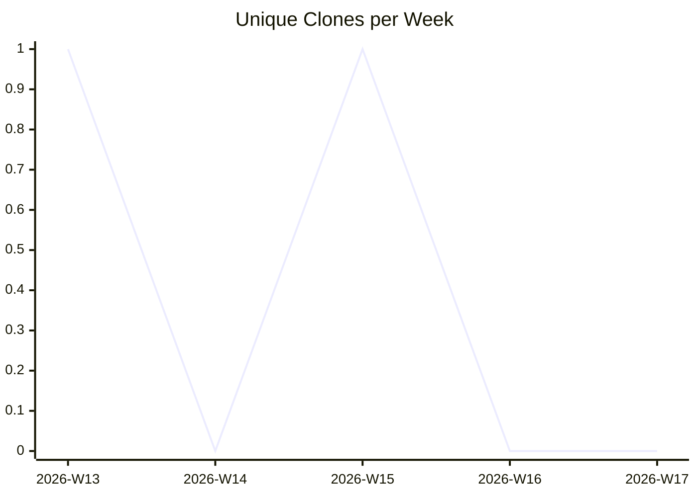

# karlmdavis/ansible-role-acmetool

_Last updated: 2026-04-23 07:49 UTC_

```mermaid
xychart-beta
  title "Unique Visitors per Week"
  x-axis ["2026-W13", "2026-W14", "2026-W15", "2026-W16", "2026-W17"]
  line [0, 0, 0, 0, 0]
```

```mermaid
xychart-beta
  title "Views per Week"
  x-axis ["2026-W13", "2026-W14", "2026-W15", "2026-W16", "2026-W17"]
  line [0, 0, 0, 0, 0]
```



## Traffic

| Month | Unique Visitors/day | Views/day | Unique Clones/day | Clones/day |
|---|---|---|---|---|
| 2026-03 | 0.0 | 0.0 | 0.1 | 0.1 |
| 2026-04 | 0.0 | 0.0 | 0.0 | 0.0 |

## Current Totals

| Metric | Value |
|---|---|
| Stars | 0 |
| Forks | 0 |
