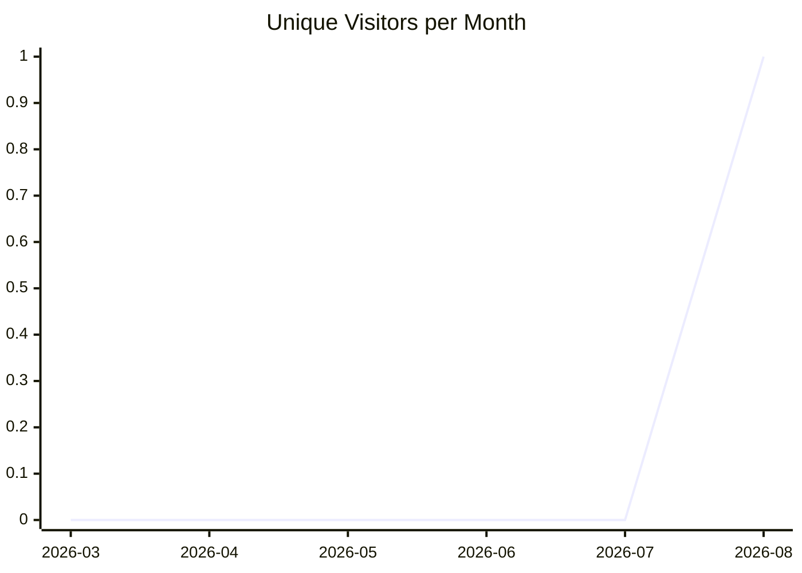
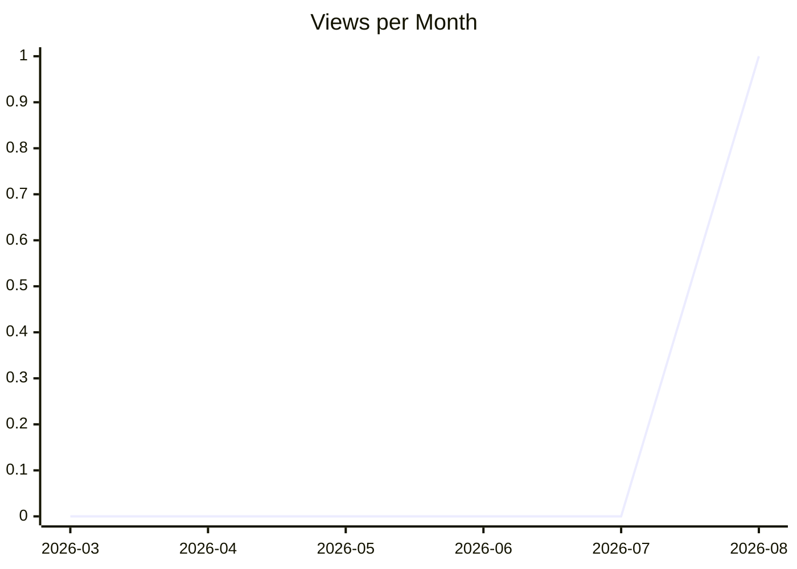
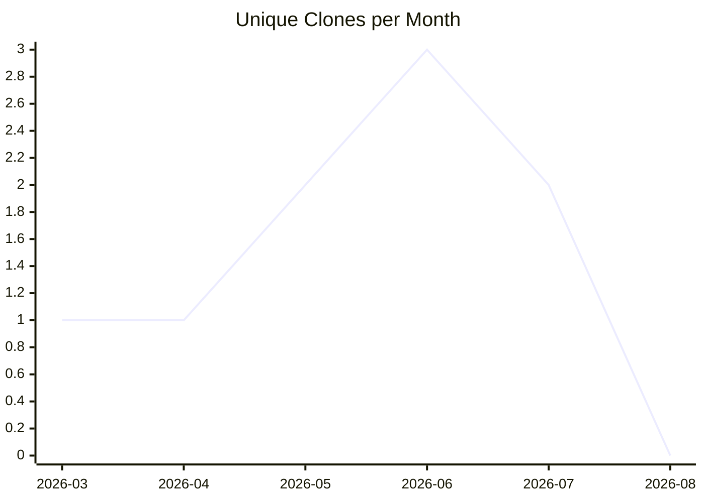

# karlmdavis/ansible-role-acmetool

_Last updated: 2026-08-21 06:40 UTC_

```mermaid
xychart-beta
  title "Unique Visitors per Month"
  x-axis ["2026-03", "2026-04", "2026-05", "2026-06", "2026-07", "2026-08"]
  line [0, 0, 0, 0, 0, 1]
```

```mermaid
xychart-beta
  title "Views per Month"
  x-axis ["2026-03", "2026-04", "2026-05", "2026-06", "2026-07", "2026-08"]
  line [0, 0, 0, 0, 0, 1]
```

```mermaid
xychart-beta
  title "Unique Clones per Month"
  x-axis ["2026-03", "2026-04", "2026-05", "2026-06", "2026-07", "2026-08"]
  line [1, 1, 2, 3, 2, 0]
```

## Traffic

| Month | Unique Visitors/day | Views/day | Unique Clones/day | Clones/day |
|---|---|---|---|---|
| 2026-03 | 0.0 | 0.0 | 0.1 | 0.1 |
| 2026-04 | 0.0 | 0.0 | 0.0 | 0.0 |
| 2026-05 | 0.0 | 0.0 | 0.1 | 0.1 |
| 2026-06 | 0.0 | 0.0 | 0.1 | 0.1 |
| 2026-07 | 0.0 | 0.0 | 0.1 | 0.1 |
| 2026-08 | 0.1 | 0.1 | 0.0 | 0.0 |

## Current Totals

| Metric | Value |
|---|---|
| Stars | 0 |
| Forks | 0 |
