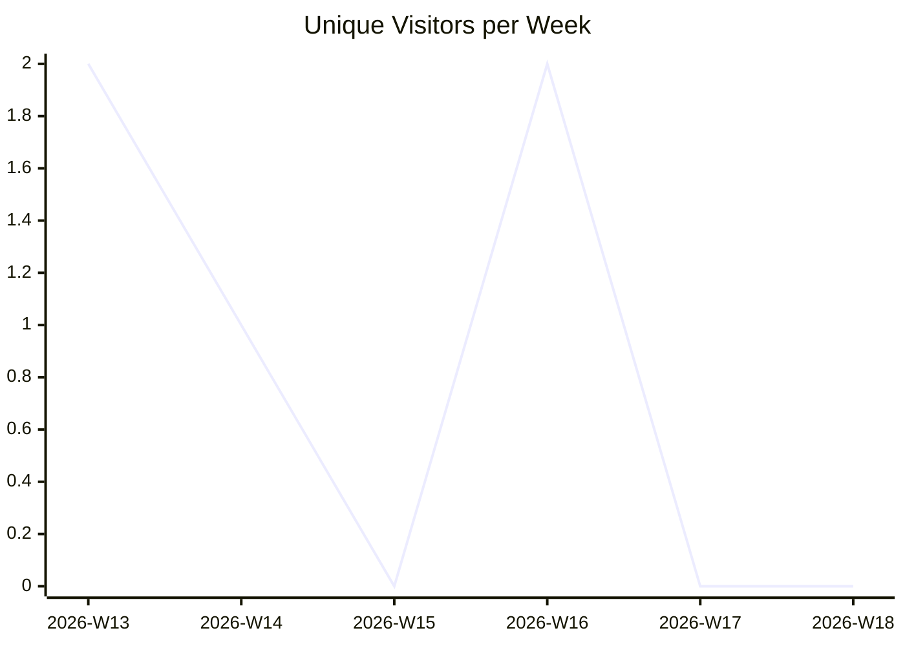
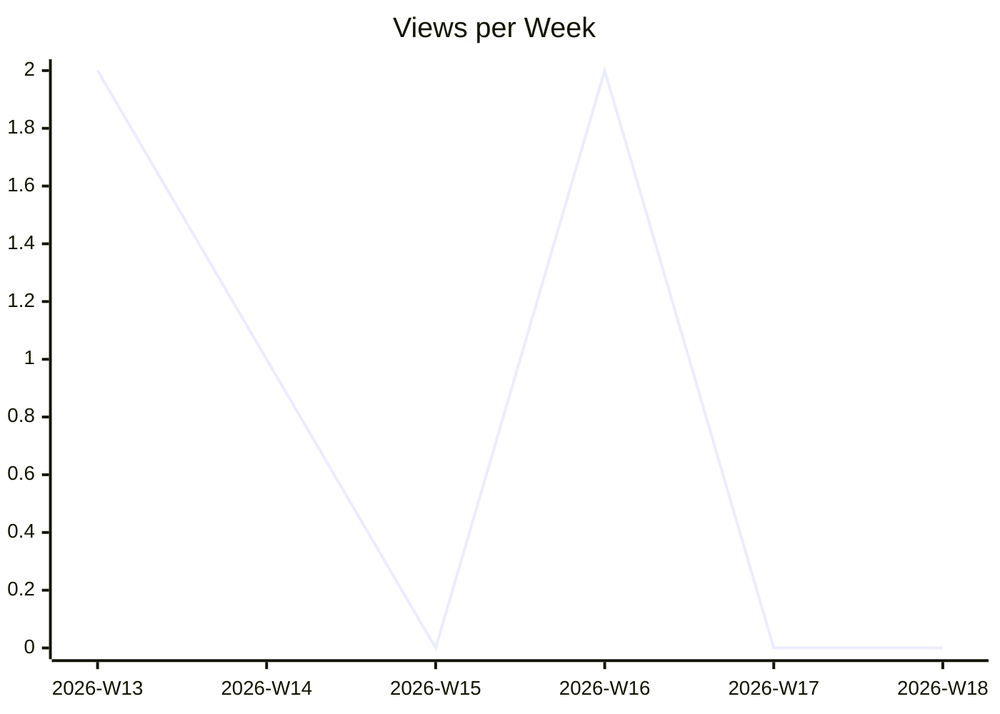
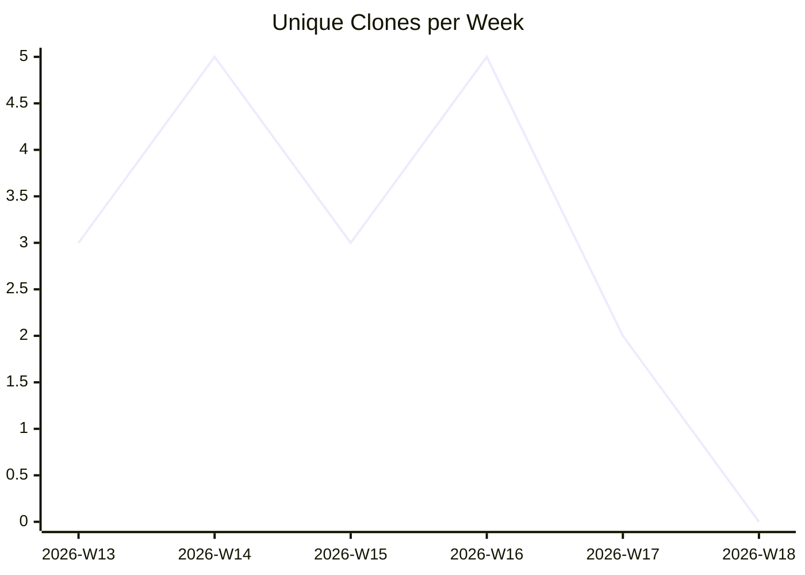

# karlmdavis/ansible-role-bind-dns

_Last updated: 2026-04-28 08:23 UTC_

## Traffic

| Month | Unique Visitors/day | Views/day | Unique Clones/day | Clones/day |
|---|---|---|---|---|
| 2026-03 | 0.2 | 0.2 | 0.4 | 0.4 |
| 2026-04 | 0.1 | 0.1 | 0.5 | 0.5 |

## Current Totals

| Metric | Value |
|---|---|
| Stars | 3 |
| Forks | 1 |
