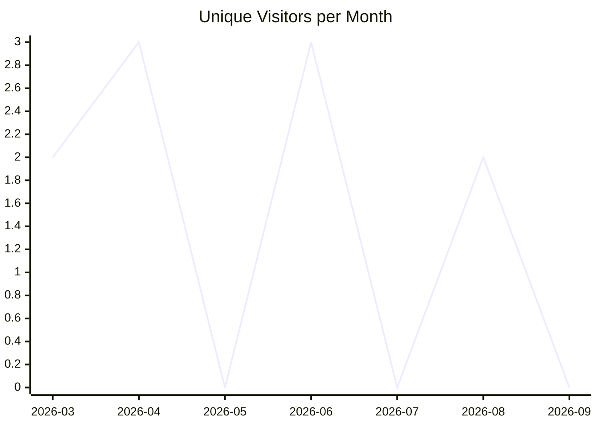
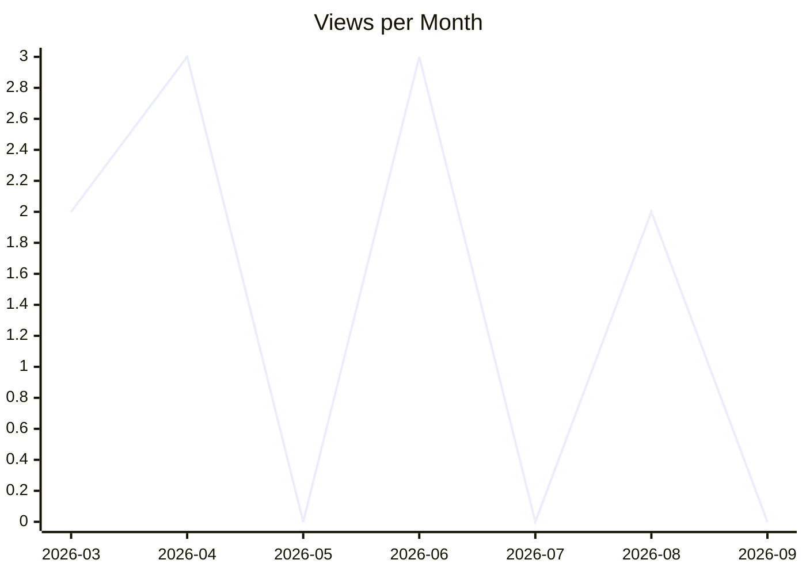
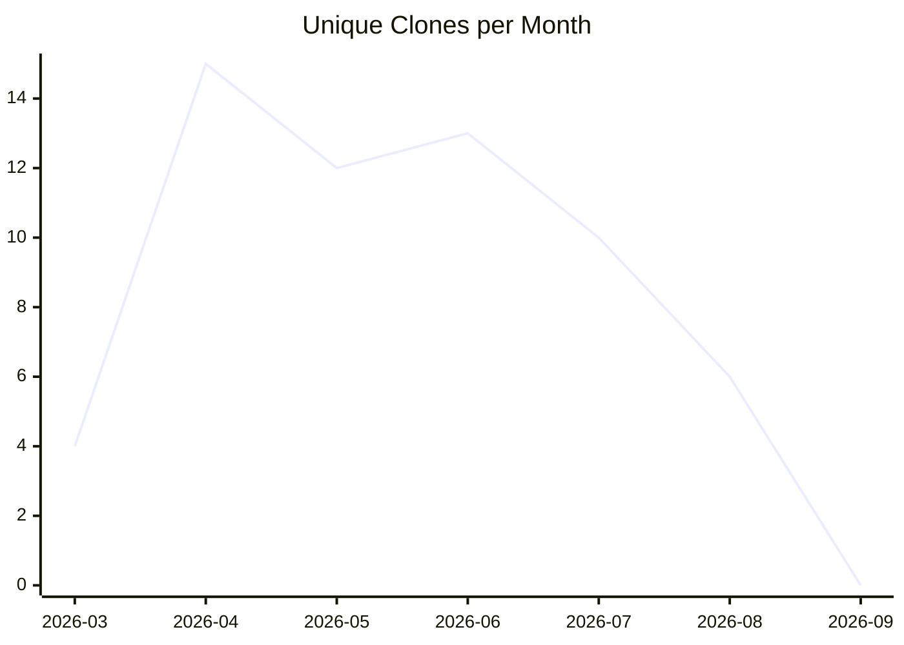

# karlmdavis/ansible-role-bind-dns

_Last updated: 2026-09-03 10:39 UTC_

```mermaid
xychart-beta
  title "Unique Visitors per Month"
  x-axis ["2026-03", "2026-04", "2026-05", "2026-06", "2026-07", "2026-08", "2026-09"]
  line [2, 3, 0, 3, 0, 2, 0]
```

```mermaid
xychart-beta
  title "Views per Month"
  x-axis ["2026-03", "2026-04", "2026-05", "2026-06", "2026-07", "2026-08", "2026-09"]
  line [2, 3, 0, 3, 0, 2, 0]
```

```mermaid
xychart-beta
  title "Unique Clones per Month"
  x-axis ["2026-03", "2026-04", "2026-05", "2026-06", "2026-07", "2026-08", "2026-09"]
  line [4, 15, 12, 13, 10, 6, 0]
```

## Traffic

| Month | Unique Visitors/day | Views/day | Unique Clones/day | Clones/day |
|---|---|---|---|---|
| 2026-03 | 0.2 | 0.2 | 0.4 | 0.4 |
| 2026-04 | 0.1 | 0.1 | 0.5 | 0.5 |
| 2026-05 | 0.0 | 0.0 | 0.4 | 0.4 |
| 2026-06 | 0.1 | 0.1 | 0.4 | 0.5 |
| 2026-07 | 0.0 | 0.0 | 0.3 | 0.3 |
| 2026-08 | 0.1 | 0.1 | 0.2 | 0.2 |
| 2026-09 | 0.0 | 0.0 | 0.0 | 0.0 |

## Current Totals

| Metric | Value |
|---|---|
| Stars | 3 |
| Forks | 1 |
