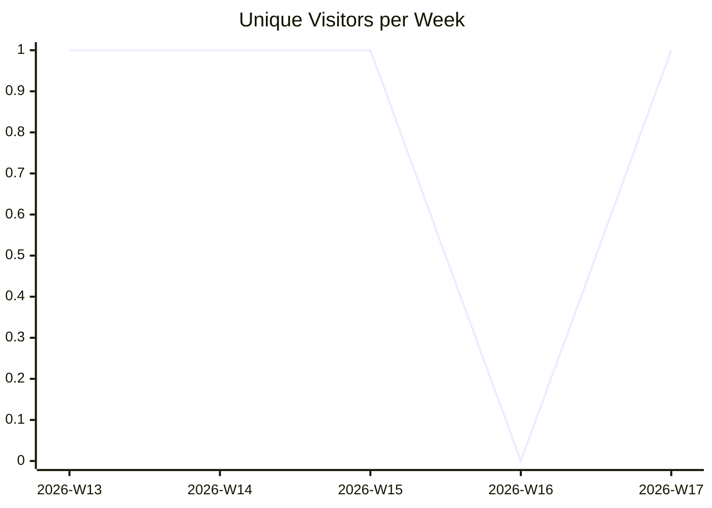
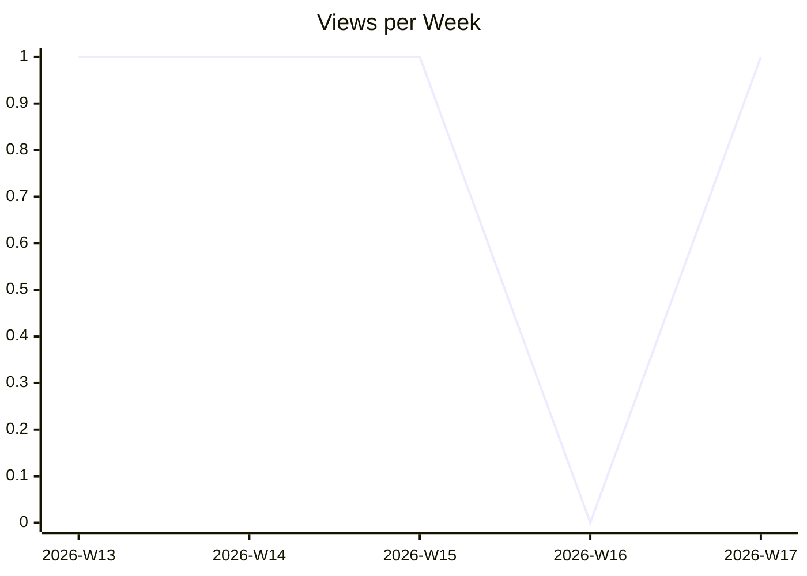
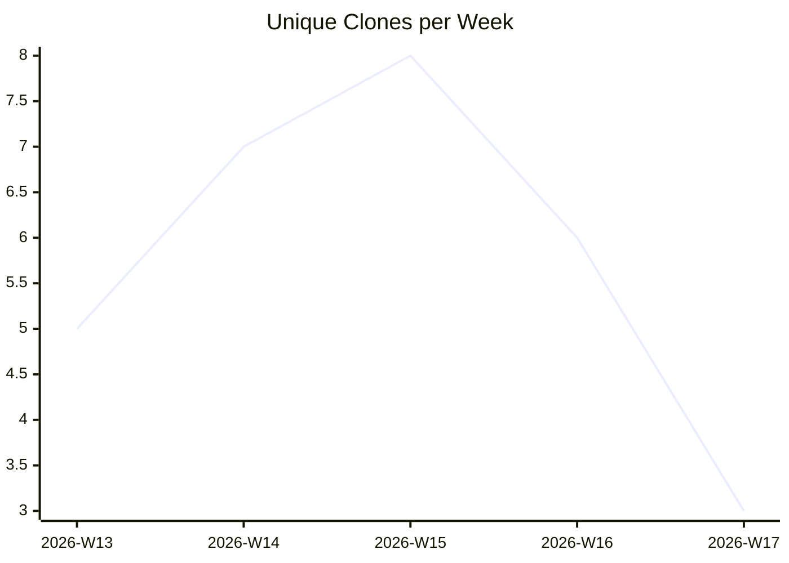

# karlmdavis/ansible-role-jenkins2

_Last updated: 2026-04-25 07:12 UTC_

## Traffic

| Month | Unique Visitors/day | Views/day | Unique Clones/day | Clones/day |
|---|---|---|---|---|
| 2026-03 | 0.2 | 0.2 | 0.7 | 0.7 |
| 2026-04 | 0.1 | 0.1 | 1.0 | 1.0 |

## Current Totals

| Metric | Value |
|---|---|
| Stars | 35 |
| Forks | 18 |
