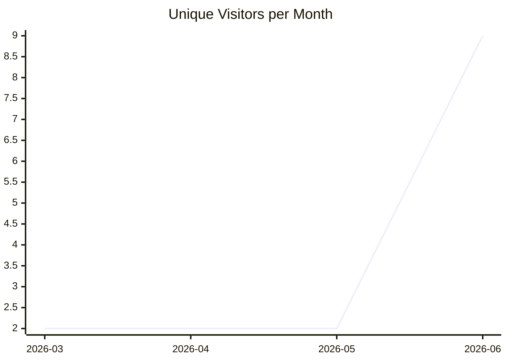
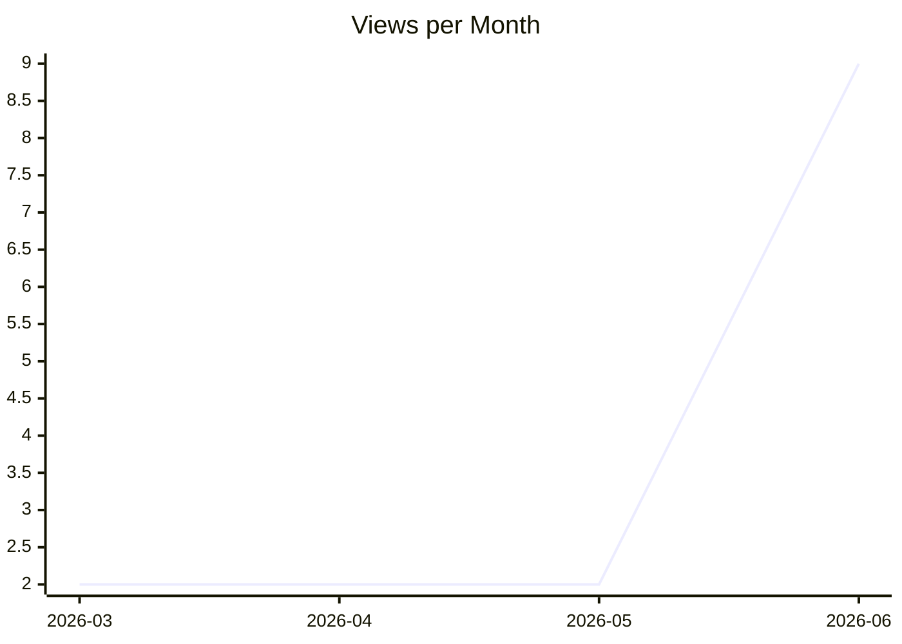
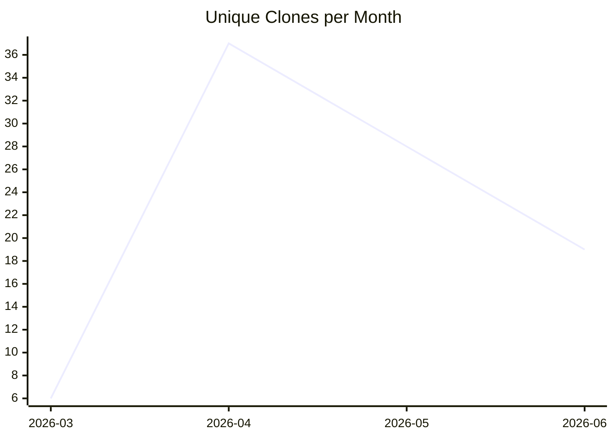

# karlmdavis/ansible-role-jenkins2

_Last updated: 2026-06-26 09:21 UTC_

```mermaid
xychart-beta
  title "Unique Visitors per Month"
  x-axis ["2026-03", "2026-04", "2026-05", "2026-06"]
  line [2, 2, 2, 9]
```

```mermaid
xychart-beta
  title "Views per Month"
  x-axis ["2026-03", "2026-04", "2026-05", "2026-06"]
  line [2, 2, 2, 9]
```

```mermaid
xychart-beta
  title "Unique Clones per Month"
  x-axis ["2026-03", "2026-04", "2026-05", "2026-06"]
  line [6, 37, 28, 19]
```

## Traffic

| Month | Unique Visitors/day | Views/day | Unique Clones/day | Clones/day |
|---|---|---|---|---|
| 2026-03 | 0.2 | 0.2 | 0.7 | 0.7 |
| 2026-04 | 0.1 | 0.1 | 1.2 | 1.3 |
| 2026-05 | 0.1 | 0.1 | 0.9 | 0.9 |
| 2026-06 | 0.4 | 0.4 | 0.8 | 0.8 |

## Current Totals

| Metric | Value |
|---|---|
| Stars | 35 |
| Forks | 18 |
