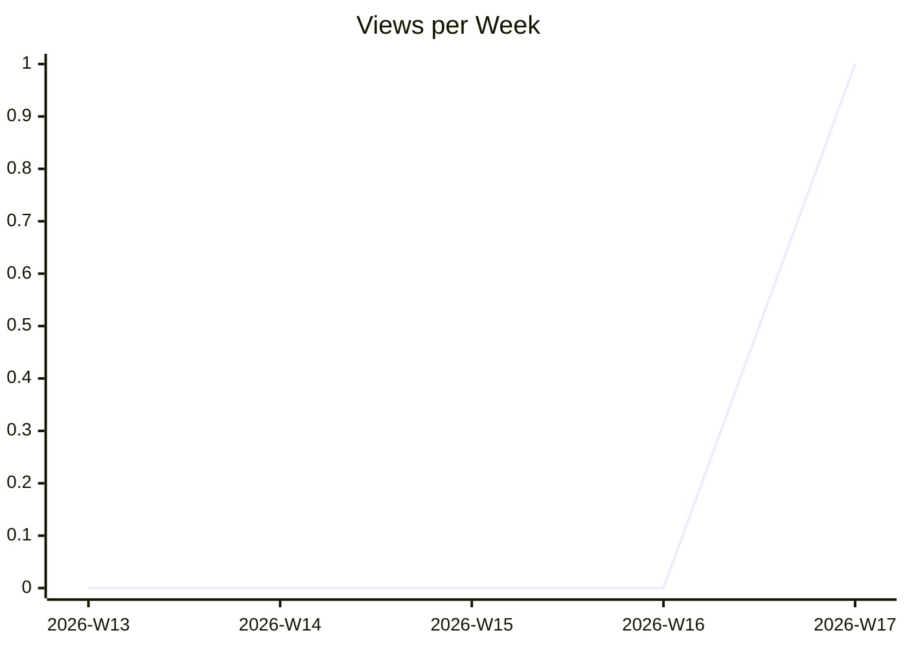
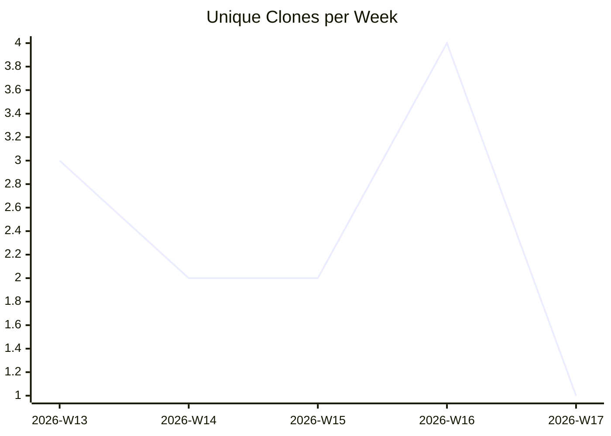

# karlmdavis/ansible-role-rcm-dotfiles

_Last updated: 2026-04-22 07:43 UTC_

## Traffic

| Month | Unique Visitors/day | Views/day | Unique Clones/day | Clones/day |
|---|---|---|---|---|
| 2026-03 | 0.0 | 0.0 | 0.4 | 0.4 |
| 2026-04 | 0.0 | 0.0 | 0.4 | 0.4 |

## Current Totals

| Metric | Value |
|---|---|
| Stars | 1 |
| Forks | 0 |
