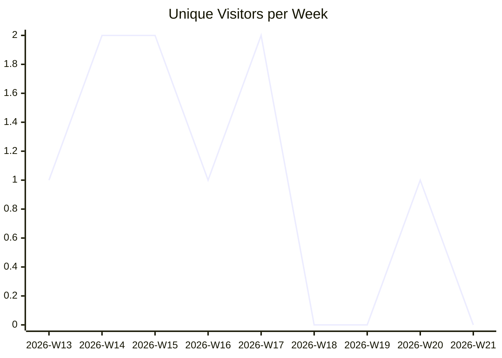
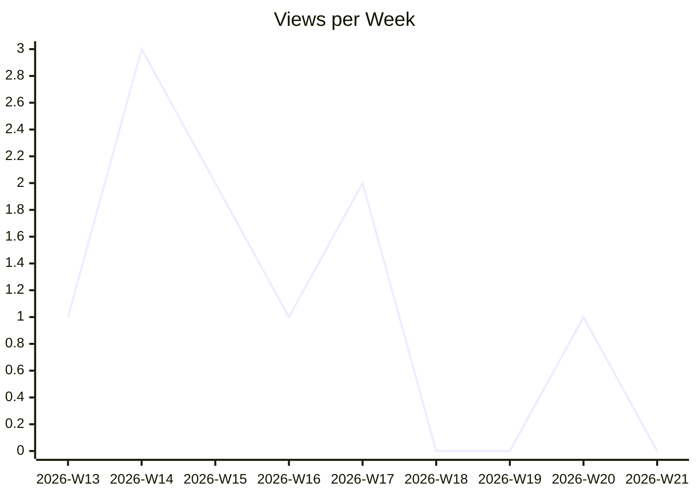
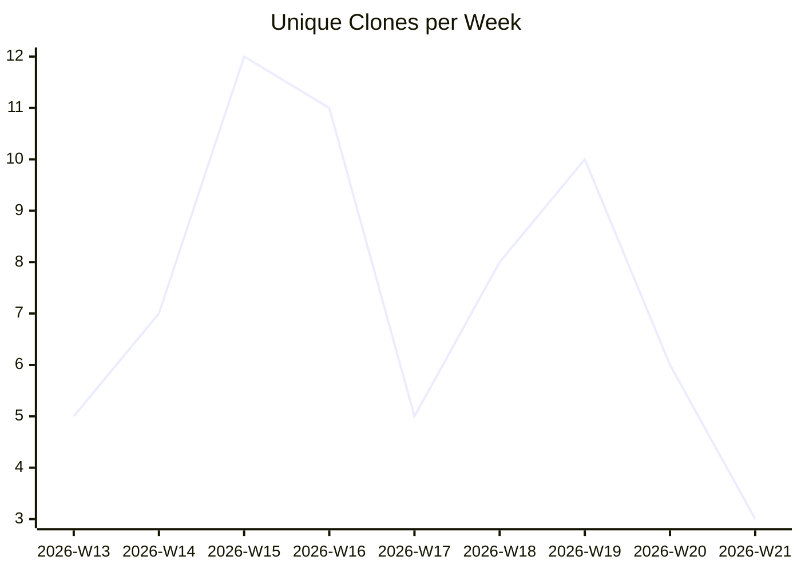

# karlmdavis/fhir-benchmarks

_Last updated: 2026-05-22 08:58 UTC_

## Traffic

| Month | Unique Visitors/day | Views/day | Unique Clones/day | Clones/day |
|---|---|---|---|---|
| 2026-03 | 0.2 | 0.2 | 0.9 | 1.0 |
| 2026-04 | 0.2 | 0.2 | 1.2 | 1.8 |
| 2026-05 | 0.0 | 0.0 | 1.1 | 1.1 |

## Current Totals

| Metric | Value |
|---|---|
| Stars | 9 |
| Forks | 3 |
