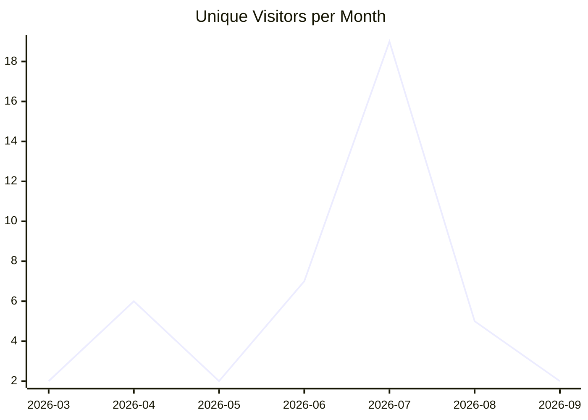
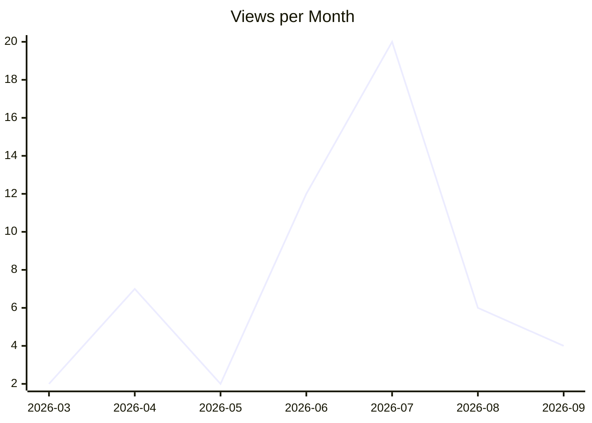
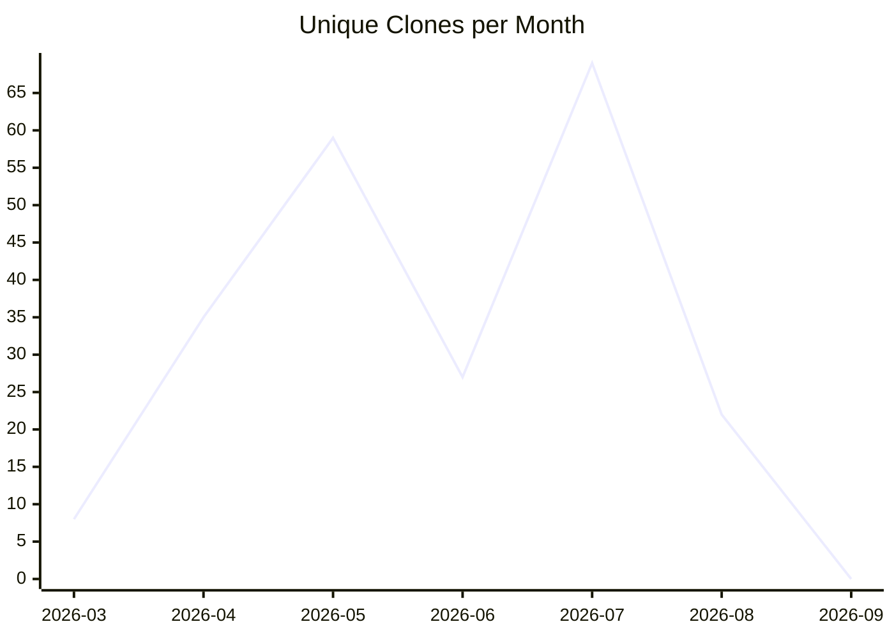

# karlmdavis/fhir-benchmarks

_Last updated: 2026-09-02 10:36 UTC_

## Traffic

| Month | Unique Visitors/day | Views/day | Unique Clones/day | Clones/day |
|---|---|---|---|---|
| 2026-03 | 0.2 | 0.2 | 0.9 | 1.0 |
| 2026-04 | 0.2 | 0.2 | 1.2 | 1.8 |
| 2026-05 | 0.1 | 0.1 | 1.9 | 2.4 |
| 2026-06 | 0.2 | 0.4 | 0.9 | 1.0 |
| 2026-07 | 0.6 | 0.6 | 2.2 | 2.5 |
| 2026-08 | 0.2 | 0.2 | 0.7 | 0.8 |
| 2026-09 | 2.0 | 4.0 | 0.0 | 0.0 |

## Current Totals

| Metric | Value |
|---|---|
| Stars | 9 |
| Forks | 3 |
