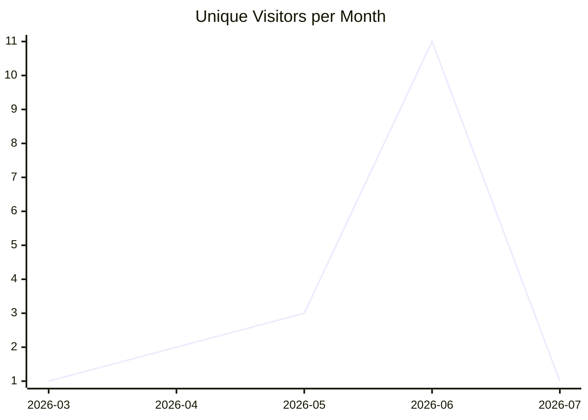
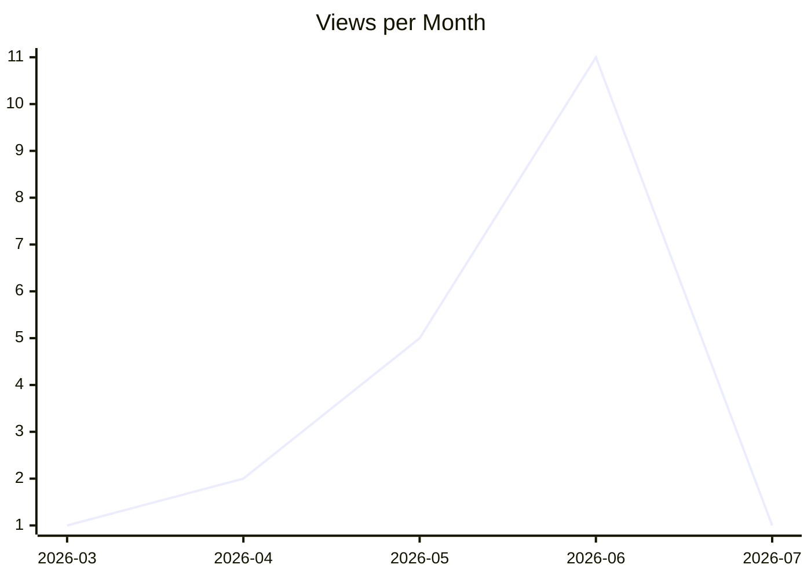
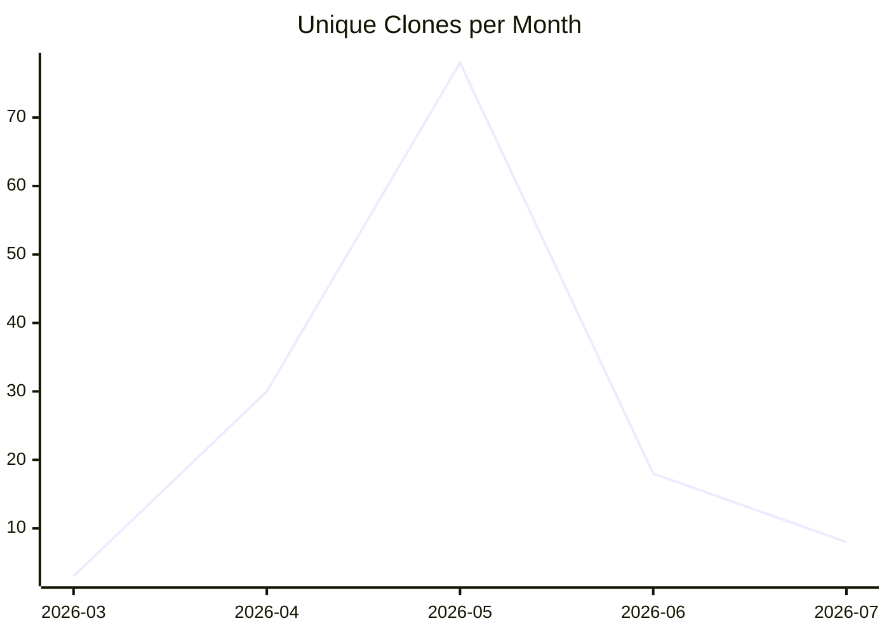

# karlmdavis/justdavis-ansible

_Last updated: 2026-07-18 07:45 UTC_

## Traffic

| Month | Unique Visitors/day | Views/day | Unique Clones/day | Clones/day |
|---|---|---|---|---|
| 2026-03 | 0.1 | 0.1 | 0.3 | 0.3 |
| 2026-04 | 0.1 | 0.1 | 1.0 | 1.5 |
| 2026-05 | 0.1 | 0.2 | 2.5 | 7.0 |
| 2026-06 | 0.4 | 0.4 | 0.6 | 1.2 |
| 2026-07 | 0.1 | 0.1 | 0.5 | 0.5 |

## Current Totals

| Metric | Value |
|---|---|
| Stars | 2 |
| Forks | 1 |
