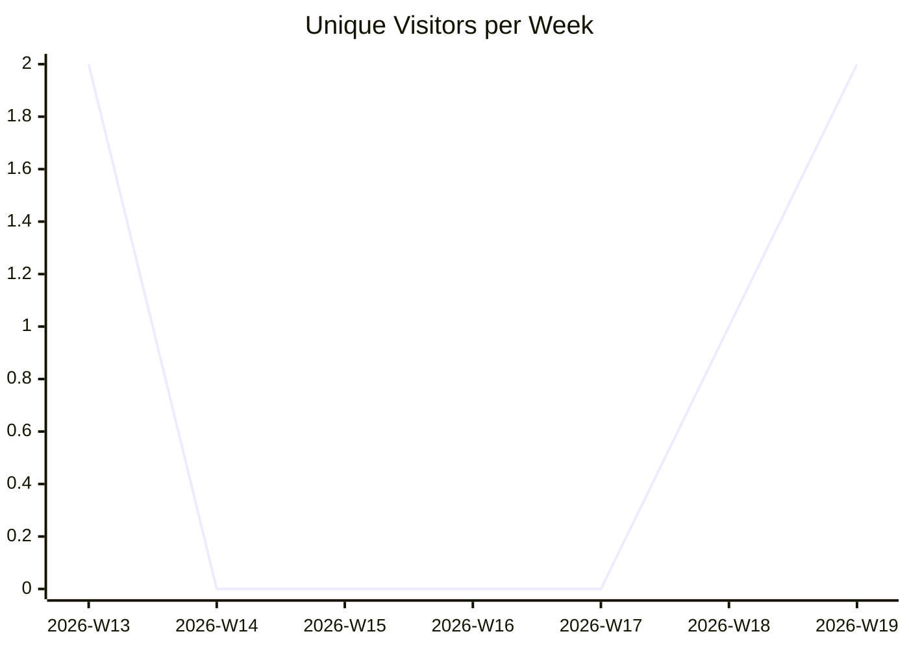
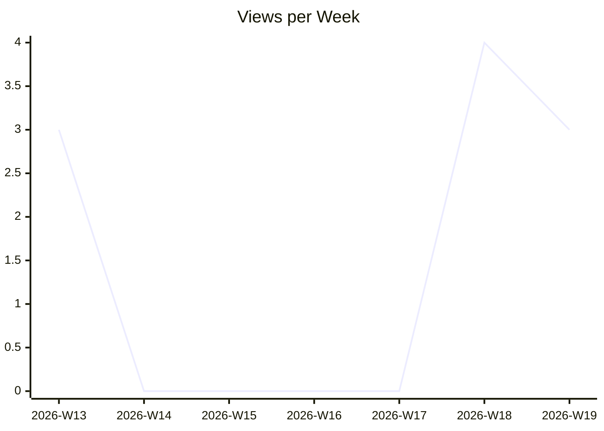
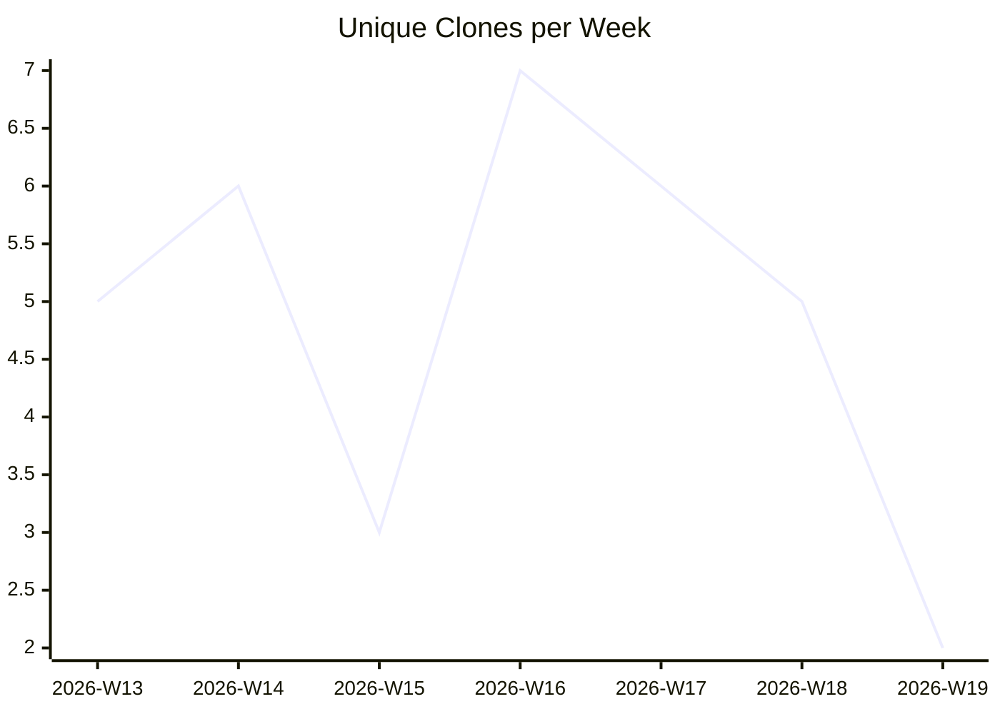

# karlmdavis/kxml2

_Last updated: 2026-05-09 07:53 UTC_

## Traffic

| Month | Unique Visitors/day | Views/day | Unique Clones/day | Clones/day |
|---|---|---|---|---|
| 2026-03 | 0.2 | 0.3 | 1.0 | 1.2 |
| 2026-04 | 0.0 | 0.1 | 0.7 | 0.9 |
| 2026-05 | 0.2 | 0.4 | 0.6 | 0.6 |

## Current Totals

| Metric | Value |
|---|---|
| Stars | 4 |
| Forks | 6 |
