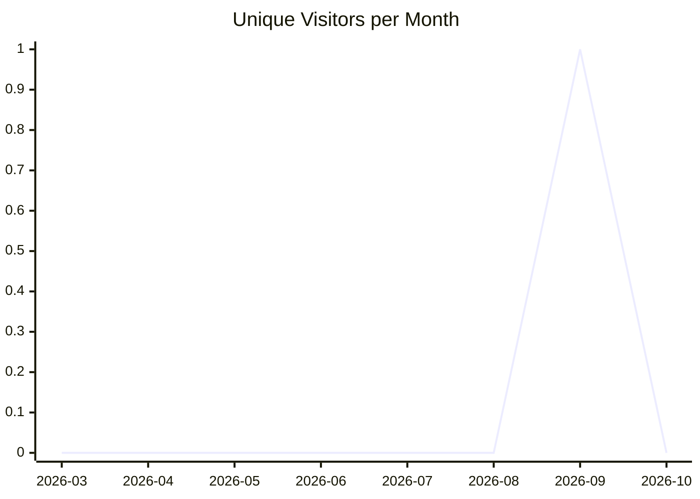
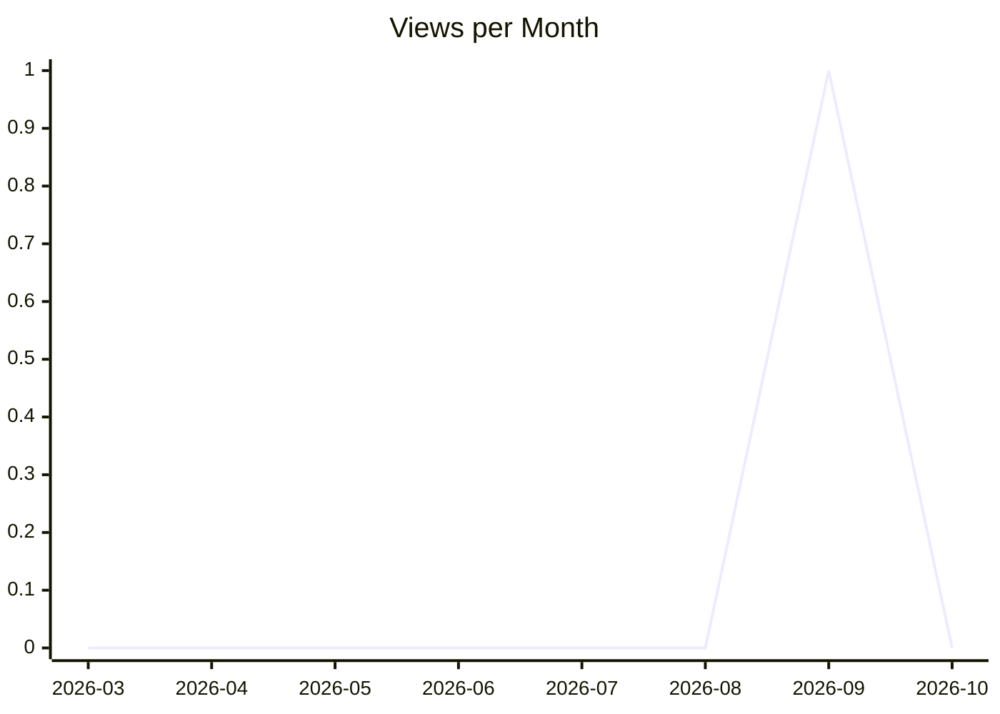
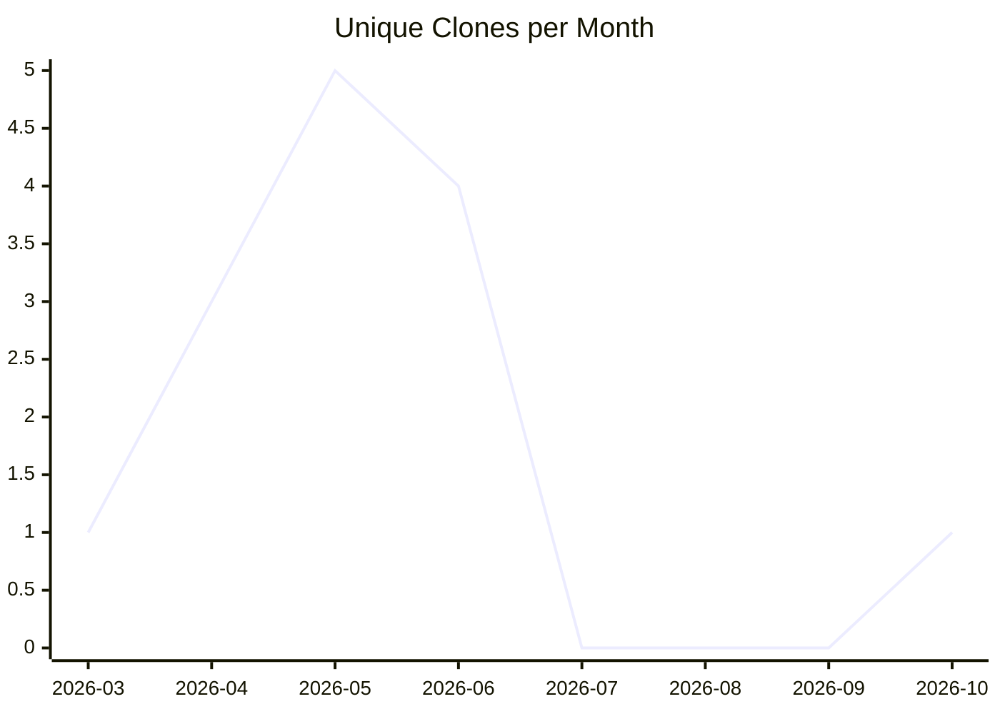

# karlmdavis/liquibase

_Last updated: 2026-10-10 11:53 UTC_

## Traffic

| Month | Unique Visitors/day | Views/day | Unique Clones/day | Clones/day |
|---|---|---|---|---|
| 2026-03 | 0.0 | 0.0 | 0.1 | 0.1 |
| 2026-04 | 0.0 | 0.0 | 0.1 | 0.1 |
| 2026-05 | 0.0 | 0.0 | 0.2 | 0.2 |
| 2026-06 | 0.0 | 0.0 | 0.1 | 0.1 |
| 2026-07 | 0.0 | 0.0 | 0.0 | 0.0 |
| 2026-08 | 0.0 | 0.0 | 0.0 | 0.0 |
| 2026-09 | 0.0 | 0.0 | 0.0 | 0.0 |
| 2026-10 | 0.0 | 0.0 | 0.1 | 0.3 |

## Current Totals

| Metric | Value |
|---|---|
| Stars | 0 |
| Forks | 0 |
