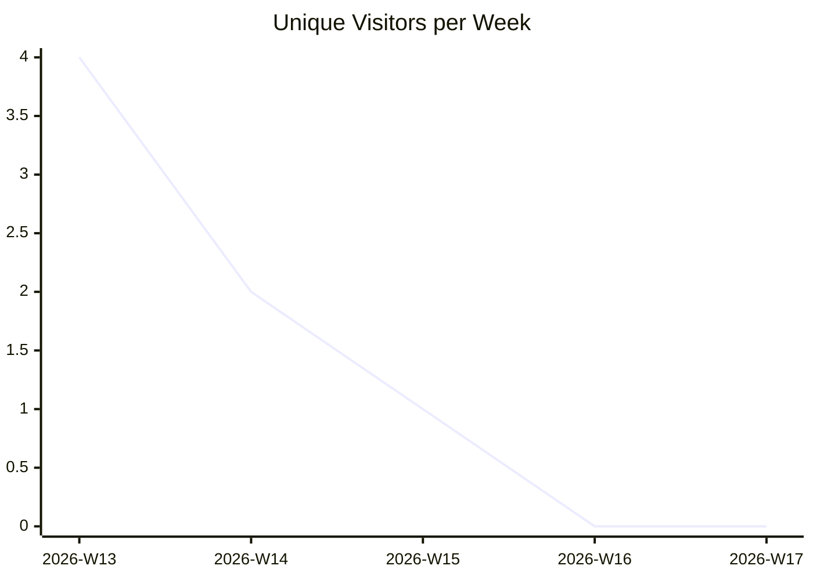
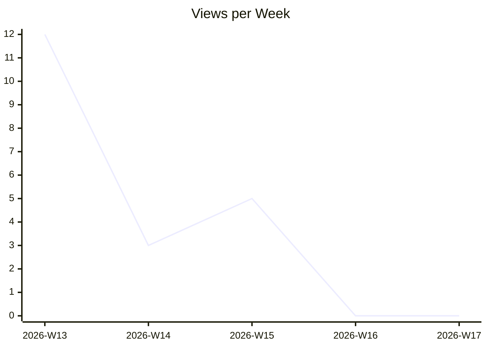
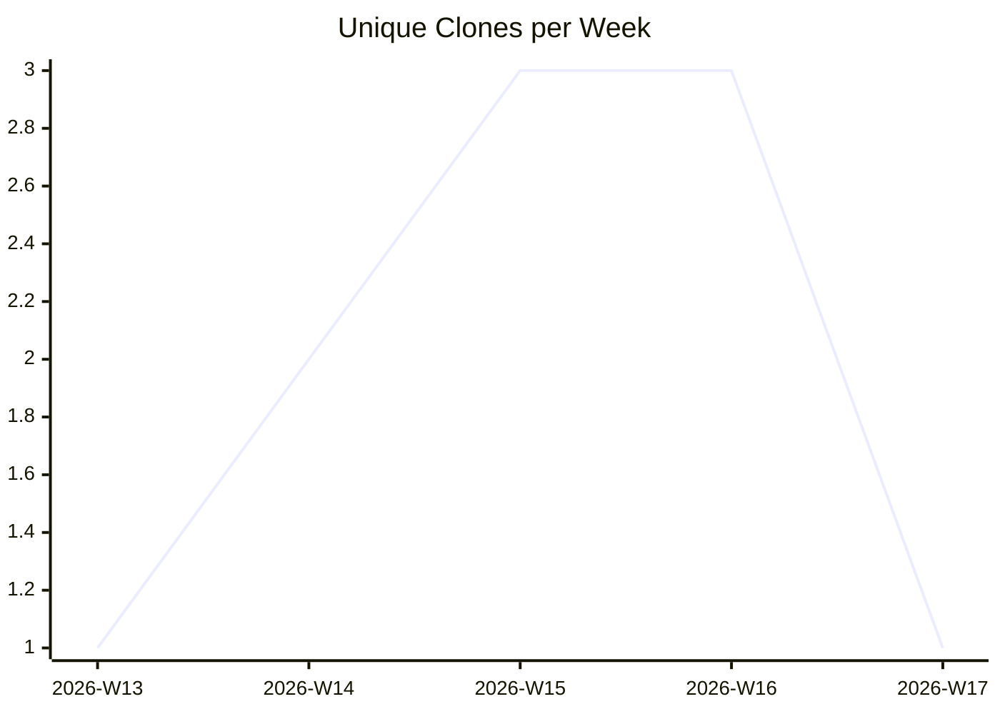

# karlmdavis/xmlpull

_Last updated: 2026-04-22 07:43 UTC_

## Traffic

| Month | Unique Visitors/day | Views/day | Unique Clones/day | Clones/day |
|---|---|---|---|---|
| 2026-03 | 0.7 | 1.7 | 0.2 | 0.2 |
| 2026-04 | 0.0 | 0.2 | 0.4 | 0.4 |

## Current Totals

| Metric | Value |
|---|---|
| Stars | 7 |
| Forks | 7 |
