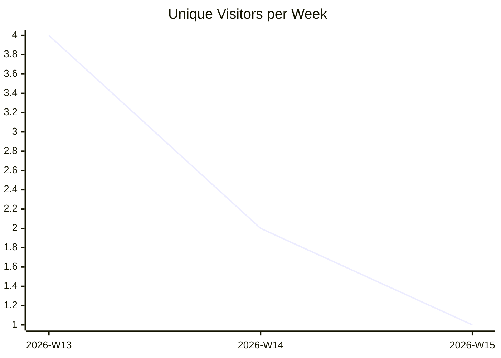
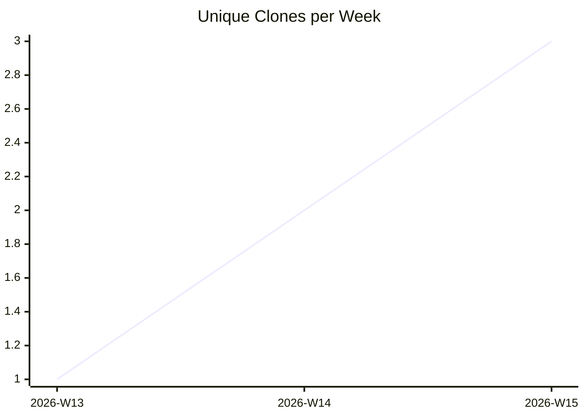

# karlmdavis/xmlpull

_Last updated: 2026-04-13 08:00 UTC_



```mermaid
xychart-beta
  title "Views per Week"
  x-axis ["2026-W13", "2026-W14", "2026-W15"]
  line [12, 3, 5]
```



## Traffic

| Month | Unique Visitors/day | Views/day | Unique Clones/day | Clones/day |
|---|---|---|---|---|
| 2026-03 | 0.7 | 1.7 | 0.2 | 0.2 |
| 2026-04 | 0.1 | 0.4 | 0.3 | 0.3 |

## Current Totals

| Metric | Value |
|---|---|
| Stars | 7 |
| Forks | 7 |
