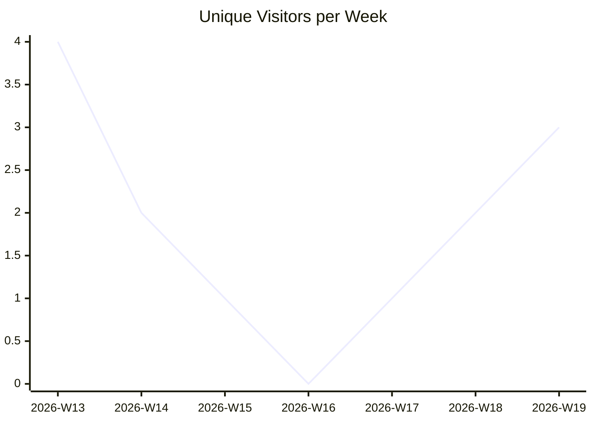
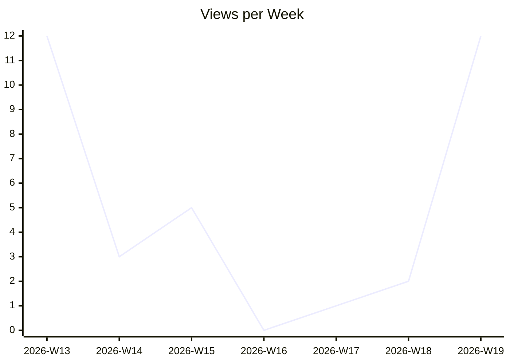
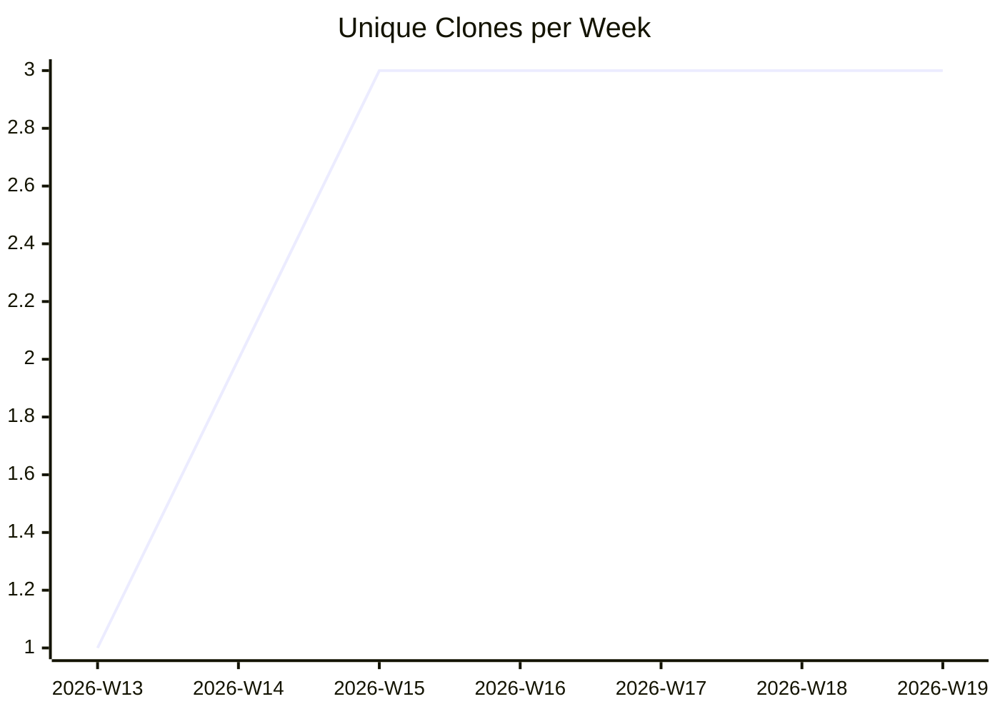

# karlmdavis/xmlpull

_Last updated: 2026-05-09 07:53 UTC_

```mermaid
xychart-beta
  title "Unique Visitors per Week"
  x-axis ["2026-W13", "2026-W14", "2026-W15", "2026-W16", "2026-W17", "2026-W18", "2026-W19"]
  line [4, 2, 1, 0, 1, 2, 3]
```

```mermaid
xychart-beta
  title "Views per Week"
  x-axis ["2026-W13", "2026-W14", "2026-W15", "2026-W16", "2026-W17", "2026-W18", "2026-W19"]
  line [12, 3, 5, 0, 1, 2, 12]
```

```mermaid
xychart-beta
  title "Unique Clones per Week"
  x-axis ["2026-W13", "2026-W14", "2026-W15", "2026-W16", "2026-W17", "2026-W18", "2026-W19"]
  line [1, 2, 3, 3, 3, 3, 3]
```

## Traffic

| Month | Unique Visitors/day | Views/day | Unique Clones/day | Clones/day |
|---|---|---|---|---|
| 2026-03 | 0.7 | 1.7 | 0.2 | 0.2 |
| 2026-04 | 0.1 | 0.3 | 0.3 | 0.3 |
| 2026-05 | 0.4 | 1.5 | 0.8 | 0.8 |

## Current Totals

| Metric | Value |
|---|---|
| Stars | 7 |
| Forks | 7 |
