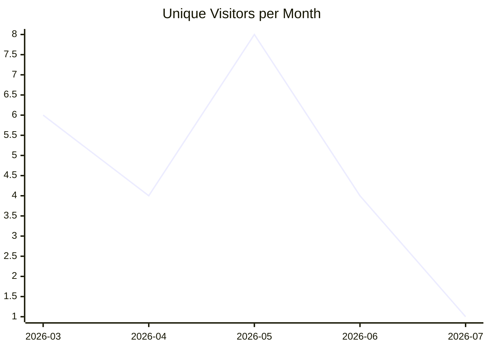
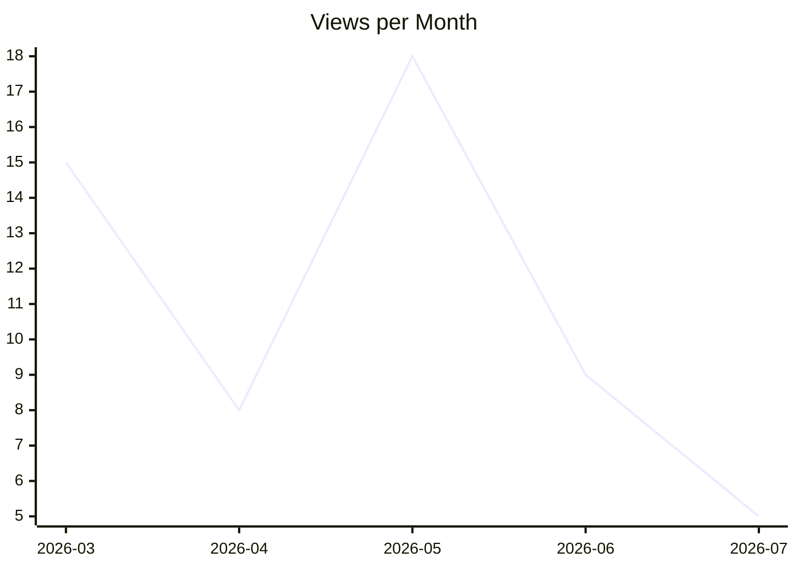
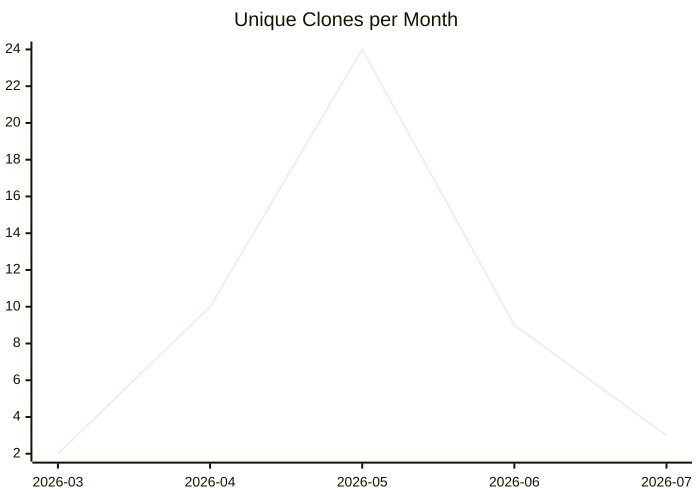

# karlmdavis/xmlpull

_Last updated: 2026-07-08 08:24 UTC_

```mermaid
xychart-beta
  title "Unique Visitors per Month"
  x-axis ["2026-03", "2026-04", "2026-05", "2026-06", "2026-07"]
  line [6, 4, 8, 4, 1]
```

```mermaid
xychart-beta
  title "Views per Month"
  x-axis ["2026-03", "2026-04", "2026-05", "2026-06", "2026-07"]
  line [15, 8, 18, 9, 5]
```

```mermaid
xychart-beta
  title "Unique Clones per Month"
  x-axis ["2026-03", "2026-04", "2026-05", "2026-06", "2026-07"]
  line [2, 10, 24, 9, 3]
```

## Traffic

| Month | Unique Visitors/day | Views/day | Unique Clones/day | Clones/day |
|---|---|---|---|---|
| 2026-03 | 0.7 | 1.7 | 0.2 | 0.2 |
| 2026-04 | 0.1 | 0.3 | 0.3 | 0.3 |
| 2026-05 | 0.3 | 0.6 | 0.8 | 1.3 |
| 2026-06 | 0.1 | 0.3 | 0.3 | 0.3 |
| 2026-07 | 0.1 | 0.7 | 0.4 | 0.4 |

## Current Totals

| Metric | Value |
|---|---|
| Stars | 7 |
| Forks | 6 |
